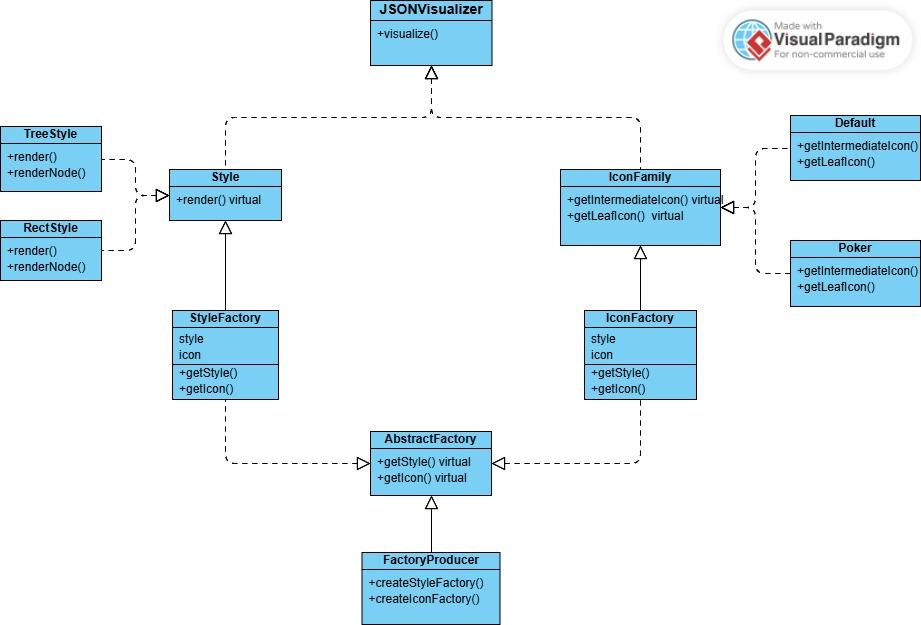

# Funny JSON Explorer设计模式实现

| 时间      | 学号     | 姓名   |
| --------- | -------- | ------ |
| 2024/6/12 | 21307333 | 洪俊东 |

## 实验要求

开发Funny JSON Explorer（**FJE**），是一个JSON文件可视化的命令行界面小工具。

```
{
    oranges: {
        'mandarin': {                            ├─ oranges
            clementine: null,                    │  └─ mandarin
            tangerine: 'cheap & juicy!'  -=>     │     ├─ clementine
        }                                        │     └─ tangerine: cheap & juicy!
    },                                           └─ apples
    apples: {                                       ├─ gala
        'gala': null,                               └─ pink lady
        'pink lady': null
    }
}
````
### 需求分析

FJE可以快速切换**风格**（style），包括：树形（tree）、矩形（rectangle）；

```

├─ oranges                             ┌─ oranges ───────────────────────────────┐
│  └─ mandarin                         │  ├─ mandarin ───────────────────────────┤
│     ├─ clementine                    │  │  ├─ clementine ──────────────────────┤
│     └─ tangerine: cheap & juicy!     │  │  ├─ tangerine: cheap & juicy! ───────┤
└─ apples                              ├─ apples ────────────────────────────────┤
   └─ gala                             └──┴─✩gala ───────────────────────────────┘

        树形（tree）                                   矩形（rectangle）
````

也可以指定**图标族**（icon family），为中间节点或叶节点指定一套icon

```
├─♢oranges                                 
│  └─♢mandarin                             
│     ├─♤clementine                        
│     └─♤tangerine: cheap & juicy!    
└─♢apples                                  
   └─♤gala                                 

poker-face-icon-family: 中间节点icon：♢ 叶节点icon：♤                 
```
### 命令行使用示例

```shell
fje -f <json file> -s <style> -i <icon family>
```

### 领域模型


### 设计模式要求
使用**工厂方法**（Factory）、**抽象工厂**（Abstract Factory）、**建造者**（Builder）模式、**组合模式**（Composition），完成功能的同时，使得程序易于扩展和维护。
1. （必做）：不改变现有代码，只需添加新的抽象工厂，即可添加新的风格
2. （选做）：通过配置文件，可添加新的图标族

## 实验步骤

按照指定的设计模式进行设计，类图如下



### 工厂模式（Factory Pattern）

工厂模式通常用于创建对象的接口，而不是在代码中直接实例化对象。在这个设计中，虽然没有一个明显的工厂类，但是我们可以通过对 `Style` 和 `IconFamily` 的选择来解释工厂模式的应用。

- `Style` 和 `IconFamily` 是抽象基类，其派生类 `TreeStyle` 和 `RectangleStyle` 以及 `PokerFaceIconFamily` 提供了具体的实现。
- 通过 `FactoryProducer` 中指定参数，可以有不同的工厂 `StyleFactory` 和 `IconFactory` 来生成具体的对象返回给 `JSONVisualizer` 使用。

### 建造者模式（Builder Pattern）

建造者模式用于分步骤创建复杂对象。在这个设计中，虽然没有明确的建造者模式的实现，但是我们可以通过 `JSONVisualizer` 的初始化过程来解释建造者模式的应用。

- `JSONVisualizer` 的构造函数接受一个 `Style` 和一个 `IconFamily` 对象，用户可以在外部配置和传递具体的风格和图标族。
- 这种配置方式可以类比为建造者模式，因为我们在构造 `JSONVisualizer` 对象时，是通过一步一步配置不同的部分来完成的。

### 组合模式（Composite Pattern）

组合模式用于将对象组合成树形结构，以表示“部分-整体”的层次结构。组合模式使得用户对单个对象和组合对象的使用具有一致性。在这个设计中，组合模式的应用非常明显。

- JSON 数据本身是一种树形结构，可以包含对象、数组等嵌套结构。
- `TreeStyle` 和 `RectangleStyle` 中的 `renderNode` 方法通过递归方式处理 JSON 对象和数组，这是一种组合模式的应用，因为每个节点可能是一个简单值（叶子节点）或复杂对象（组合节点）。
- `TreeStyle` 和 `RectangleStyle` 的 `renderNode` 方法通过递归遍历 JSON 数据的层次结构来实现可视化，这正是组合模式的核心思想。

## 实验结果

要添加新的风格，只需要像 `RectangleStyle` 一样实现并在 `factory.h` 中添加对应的选项就可以了。

**TreeStyle+DefaultIconFamily**


**TreeStyle+PokerFaceIconFamily**


**RectangleStyle+DefaultIconFamily**


**RectangleStyle+PokerFaceIconFamily**


